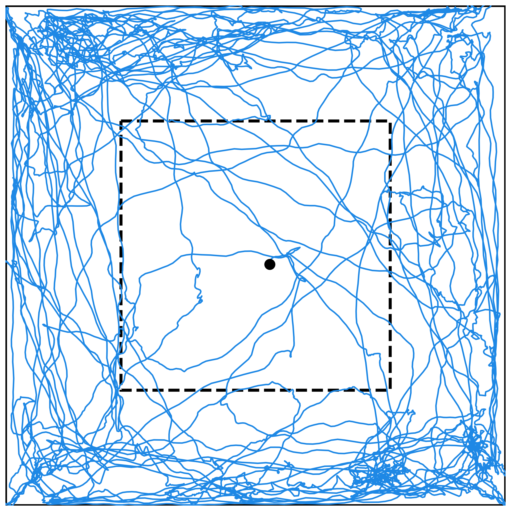
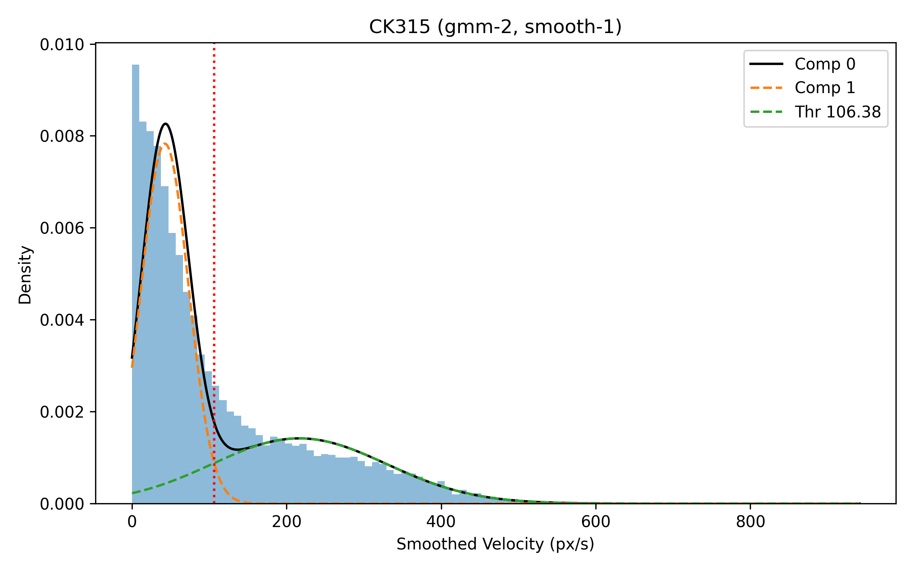

# Open Field Behavior Analysis


<a href="docs/overall_tracking_example.mp4">
  
</a>

Mask-based centroid tracking of animal movement, used for all downstream distance, velocity, center-zone, and movement-state metrics.

Video file: [docs/overall_tracking_example.mp4](docs/overall_tracking_example.mp4)

## Overview

- Segments the animal body from each video frame using grayscale thresholding, morphological cleanup, and distance-transform refinement.
- Extracts per-frame centroid and contour-derived metrics.
- Computes displacement, velocity, acceleration, and heading from centroid traces.
- Normalizes key summary metrics to each animal's baseline day.
- Quantifies center-zone occupancy and crossings into the center box.
- Fits GMMs on smoothed velocity to derive latent movement-state distributions.
- Applies thresholds to label frame-level states as `LINGER` or `PROGRESS`, with optional outlier behavior exclusion.

## Trajectory and Center Metrics

<table>
  <tr>
    <td width="56%">
      
    </td>
    <td width="44%">
      Trajectory plot of animal movement over time. Analyses performed based on the underlying data include total distance traveled, instantaneous velocity, time spent in the middle zone, and crossings into the middle.
    </td>
  </tr>
</table>

## Behavior State Analysis

<table>
  <tr>
    <td width="50%">
      
    </td>
    <td width="50%">
      <a href="docs/lingering-progressing_example.mp4">
        
      </a>
      <br>
      Video file:
      <a href="docs/lingering-progressing_example.mp4">docs/lingering-progressing_example.mp4</a>
    </td>
  </tr>
  <tr>
    <td>
      A Gaussian Mixture Model (GMM) models the velocity distribution and estimates the threshold separating behavior states.
    </td>
    <td>
      GMM-derived thresholds are used to label each frame as either progressing or lingering movement.
    </td>
  </tr>
</table>

## Notebooks

1. `crop_video_bounding_box.ipynb` (optional): select and apply arena crop boxes to videos.
2. `open_field_analysis_mask.ipynb`: main end-to-end pipeline (tracking, kinematics, center-zone, GMM, and overlays).
3. `jumping_timepoints_cleaner.ipynb` (optional): convert manually annotated jump ranges into frame ranges used for exclusion.

## Repository Layout

```text
open_field_analysis_mask.ipynb
crop_video_bounding_box.ipynb
jumping_timepoints_cleaner.ipynb
docs/
LICENSE
```

## Inputs and Outputs

- File identity format: `{animal_id}_{day_id}` (example: `RK111_PD15`).
- Baseline day expected for normalization: `PD00`.
- Outputs include per-frame CSVs, `*_processed.csv`, `summary_metrics.csv`, center-zone summaries, GMM summaries, and annotated videos.

## Requirements

- Python 3.9+
- `opencv-python`, `numpy`, `pandas`, `matplotlib`, `scipy`, `scikit-learn`
- `ffmpeg` available on PATH (used by the crop workflow)

## License

MIT. See `LICENSE`.
